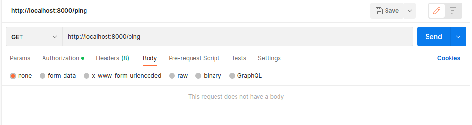
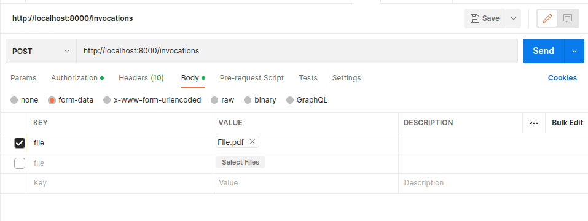

# Best Practices Python
The below repository is present on Knoldus Public Github and contains the multi-module python project with best practices and standards implemented.

# Requirements
Python 3.8

# Package Management
Create an isolated Python virtual environments. or conda

## Packaging

### 1.Create a new virtual environment by choosing a Python interpreter and making a ./venv directory to hold it(you can also use  anaconda/any other methods available):
```bash
python3 -m venv ./venv
```
### 2.Activate the virtual environment:
```bash
source ./venv/bin/activate
```
### 3.Clone the repo to the virtual envoirment directory
```
git clone <repo_name>
```
## Guide for Package Installation

### Updating the pip library
```
$python -m pip install --upgrade pip
```
### Requirements
Project requirements are present in requirements directory. For installation of the required packages run the following:
```
python setup.py install

```
# Project Structure

``` {.RasaApp .}
├── src
│   ├── __init__.py
│   └── rasa_app
│       ├── actions
│       │   └── actions.py
│       ├── config.yml
│       ├── credentials.yml
│       ├── data
│       │   ├── entity_extracted_data
│       │   ├── input_data
│       │   ├── nlu.yml
│       │   ├── rules.yml
│       │   └── stories.yml
│       ├── domain.yml
│       ├── endpoints.yml
│       ├── __init__.py
│       └── lib
│           ├── config_validator.py
│           ├── error_handlers.py
│           ├── logger.py
│           ├── preprocessor.py
│           ├── rasa_agent.py
│           └── response_creator.py
└── tests
    ├── __init__.py
    └── unit_tests
        ├── __init__.py
        ├── test_app.py
        └── test_preprocessor.py
        
```


# User Guide


### Remove the .gitkeep file present inside app_data/input_data & app_data/entity_extracted_data (Check for hidden files to make sure)

###  To Run
```
$python3 app.py
```

### Check the app through Postman (the app will run on localhost:8000)

GET: Check whether the server is running or not
```
http://localhost:8000/ping

```



POST: Input a .pdf as a body through postman
```
http://localhost:8000/invocations

```



# Enforcing Code Quality

Automated code quality checks are performed using [pre-commit](https://pre-commit.com/). Code quality tool are present in .pre-commit-config.yaml file. Additional code quality tools can be added or removed through the .pre-commit-config.yaml file

List of Code Quality tools used are as follows

- `flake8`
- `pylint`
- `bandit`
- `black`
- `isort`

### To run all present checks:

Note:Make sure to initialize git using below command,If it isn't initialized.
```
$git init
```
Add all the files to staging by using
```
$git add .
```
Run code quality checks
```
$pre-commit run --all-files
```

### Testing
Testing is performed with pytest. pytest has become the de facto Python unit testing framework.
Code coverage is provided by
```bash
$ pytest-cov
```

### Logfile is stored in logs directory in (yyyy-mm-dd) format

# Container

[Docker](https://www.docker.com/) is a tool that allows for software to be packaged into isolated
containers.


To build the container image:

```bash
$ docker build -t <image_name> .
```

To run the image in a container:

```bash
$ docker run <image_name>
```
